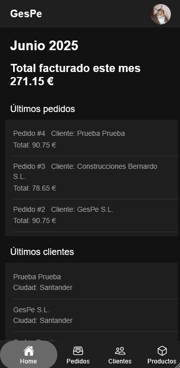
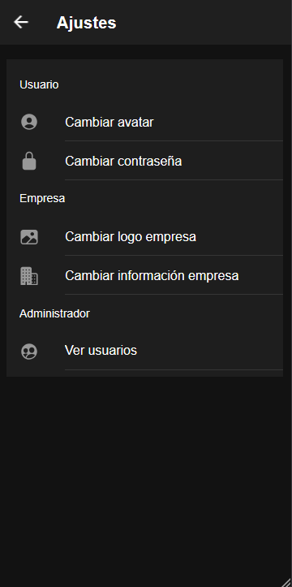
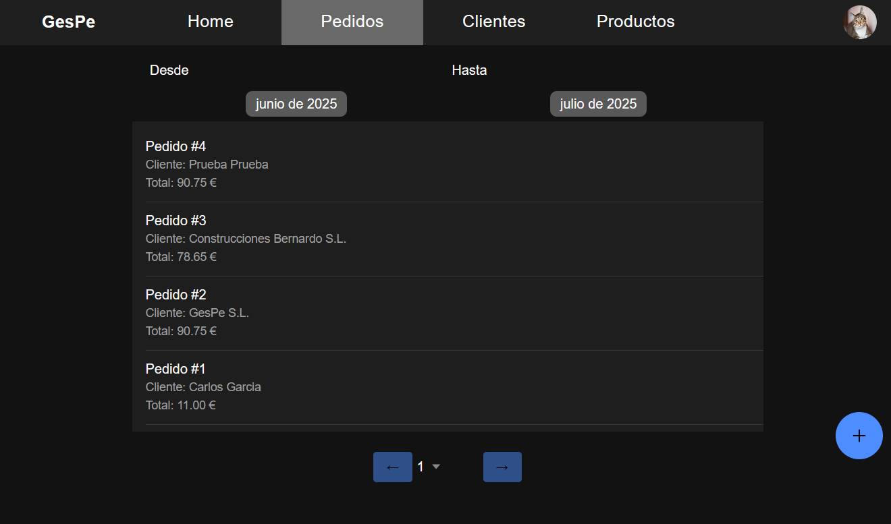
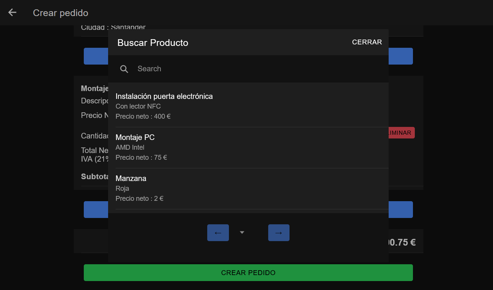
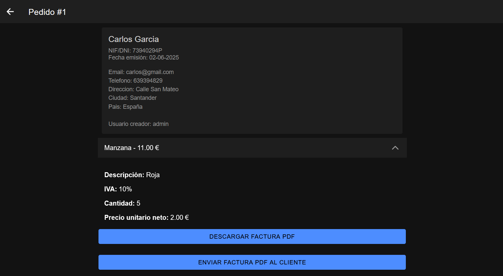

# 🌟 GESPE

**Gestor de Pedidos desarrollado con Ionic Angular**

Gespe es una aplicación para la gestión de pedidos, diseñada para dispositivos móviles, creada con [Ionic](https://ionicframework.com/) y [Angular](https://angular.io/).  
Está pensada para negocios o personas que necesiten administrar pedidos de manera eficiente con una interfaz moderna y responsiva.

---

## 🚀 Funcionalidades

- 📦 Crear, ver y actualizar pedidos fácilmente  
- 👤 Gestionar clientes y sus datos  
- 📱 Interfaz totalmente responsive (mobile-first)  
- 🛠️ Construido con Angular e Ionic para apps híbridas  
- 🌐 Interfaz en español

---

## 📸 Capturas de pantalla

